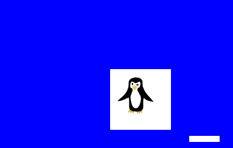

# OpenClubPenguin

Henlo disney pls no sue me thank

## Quickstart

        git clone https://github.com/ChillerDragon/OpenClubPenguin
        cd OpenClubPenguin

        npm install
        npm run server

## Dogger

        git clone https://github.com/ChillerDragon/OpenClubPenguin
        cd OpenClubPenguin

        docker build -t ocp .
        docker run -d -p 6827:6827 -t ocp

## Wot is dis?

It is a web multiplayer game inspired by the best MMO ever made.

The backend (game server) is written in express and uses
socket.io websockets to talk to the web front end (game client) that uses a html canvas to render the game

## Development

[network protocol](./docs/network.md)